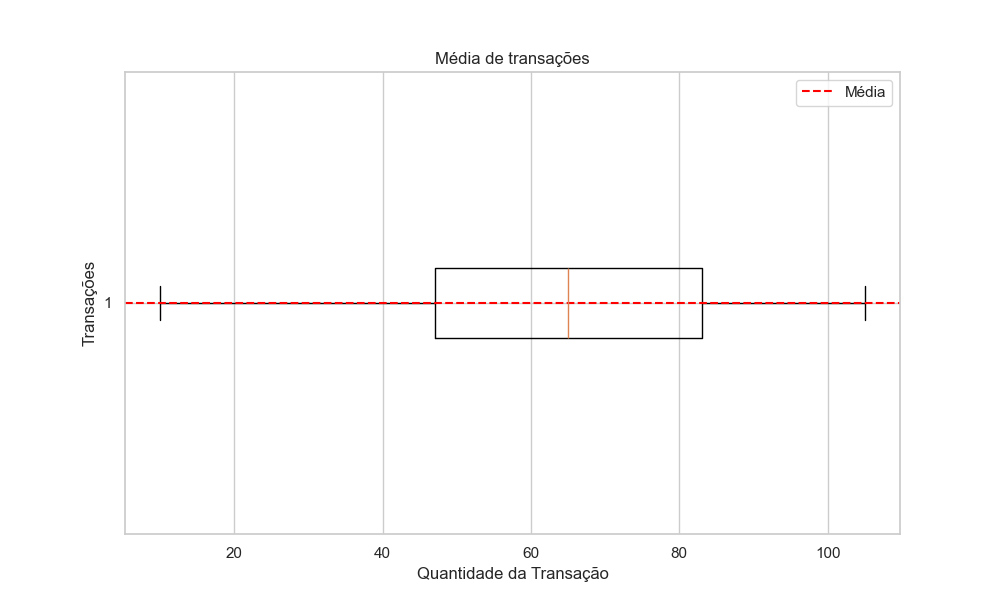
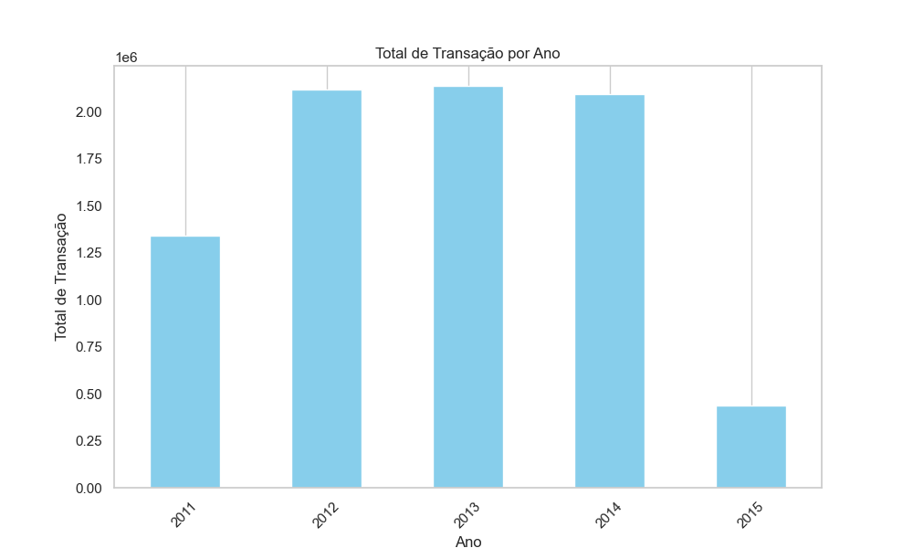

# Análise Exploratória de Dados

## Introdução
Este documento apresenta os principais insights obtidos durante a análise exploratória do conjunto de dados "basic-analytics.csv".

## Total de Transações
- Total de transações: [125000]

## Média e Desvio Padrão das Transações
- Média das transações: [64.99]
- Desvio padrão das transações: [22.86]

## Números importantes
- Quantidade média de transações por cliente: [18.14]
- Transação que mais se repete entre todos os meses: [49]
- O maior valor de transação é: [105]
- O menor valor de transação é: [10]

## Total de transações por ano
- 2011: [1.340.339] - Média: [64.88]
- 2012: [2.116.599] - Média: [65.04]
- 2013: [2.137.368] - Média: [64.96]
- 2014: [2.094.508] - Média: [64.99]
- 2015: [435.175] - Média: [65.23]

- Total de todos os anos: [8.123.989]

## Ano que mais/menos vendeu
- O ano que mais vendeu foi o ano 2013 com um total de [2.137.368] transações.
- O ano que menos vendeu foi o ano 2015 com um total de [435.175] transações.
- O ano que menos vendeu (desconsiderando 2015 e 2011) foi o ano 2014 com um total de [2094508] transações.

## Total de Transações por mês
- Total de Transações para o mês 1: [724.107]
- Total de Transações para o mês 2: [645.154]
- Total de Transações para o mês 3: [636.577]
- Total de Transações para o mês 4: [515.791]
- Total de Transações para o mês 5: [633.212]
- Total de Transações para o mês 6: [697.014]
- Total de Transações para o mês 7: [717.223]
- Total de Transações para o mês 8: [726.921]
- Total de Transações para o mês 9: [694.433]
- Total de Transações para o mês 10: [725.320]
- Total de Transações para o mês 11: [698.273]
- Total de Transações para o mês 12: [709.964]

## Média de Transações por mês
- Média de Transação para o mês 1: [64.97]
- Média de Transação para o mês 2: [64.91]
- Média de Transação para o mês 3: [65.27]
- Média de Transação para o mês 4: [64.68]
- Média de Transação para o mês 5: [65.35]
- Média de Transação para o mês 6: [64.8]
- Média de Transação para o mês 7: [64.99]
- Média de Transação para o mês 8: [64.92]
- Média de Transação para o mês 9: [64.97]
- Média de Transação para o mês 10: [64.87]
- Média de Transação para o mês 11: [65.42]
- Média de Transação para o mês 12: [64.74]

## Gráfico de dispersão com recência 

## Clientes com Maior Quantidade de Transações
- Os 10 clientes com maior quantidade de transações:
  1. CS4424 - transações - [39] - Média: [75.21]
  2. CS4320 - transações - [38] - Média: [69.66]
  3. CS3799 - transações - [36] - Média: [69.81]
  4. CS1215 - transações - [35] - Média: [67.49]
  5. CS5109 - transações - [35] - Média: [71.60]
  6. CS3805 - transações - [35] - Média: [70.09]
  7. CS2620 - transações - [35] - Média: [67.43]
  8. CS3013 - transações - [35] - Média: [64.54]
  9. CS4074 - transações - [34] - Média: [72.41]
  10. CS4998 - transações - [34] - Média: [69.35]

## Meses que mais/menos venderam
- Os três meses que mais venderam foram:
1. Mês: 8 - Total de transações: [726.921]
2. Mês: 10 - Total de transações: [725.320]
3. Mês: 1 - Total de transações: [724.107]

- Os três meses que menos venderam foram:
1. Mês: 4 - Total de transações: [515.791]
2. Mês: 5 - Total de transações: [633.212]
3. Mês: 3 - Total de transações: [636.577]

